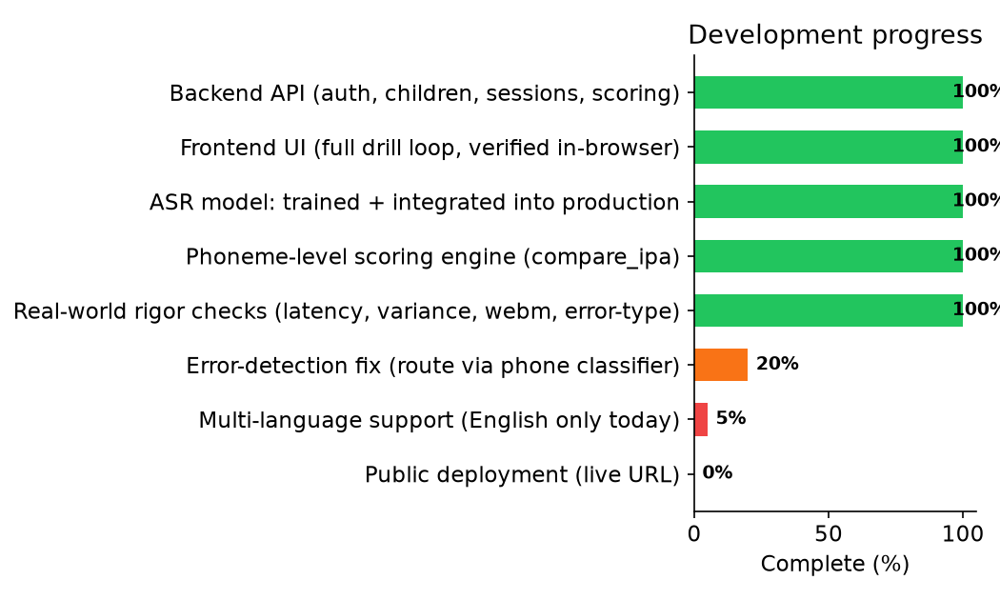
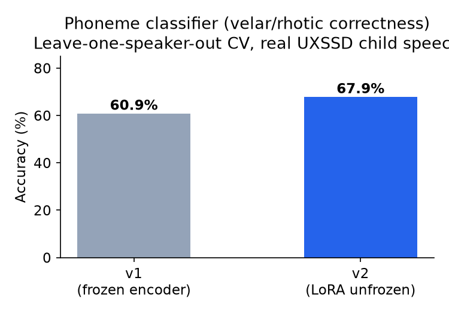
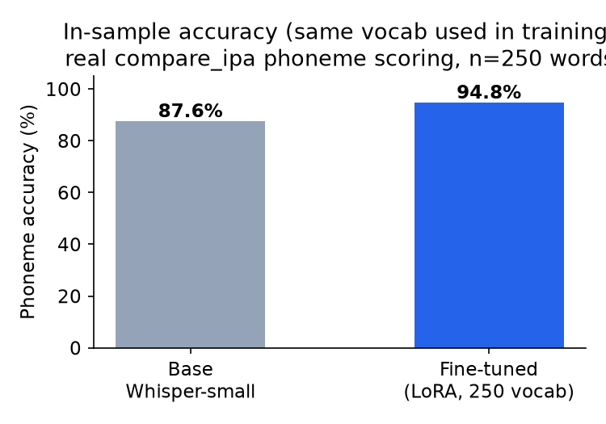
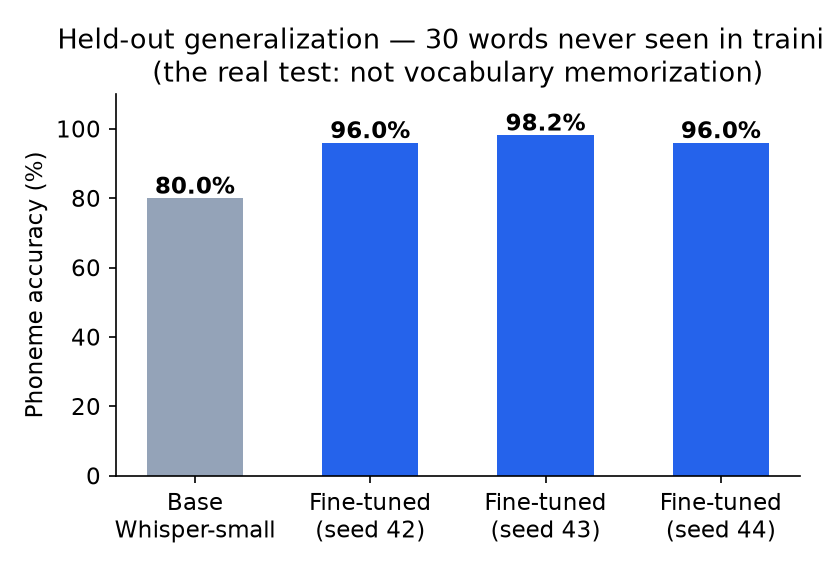
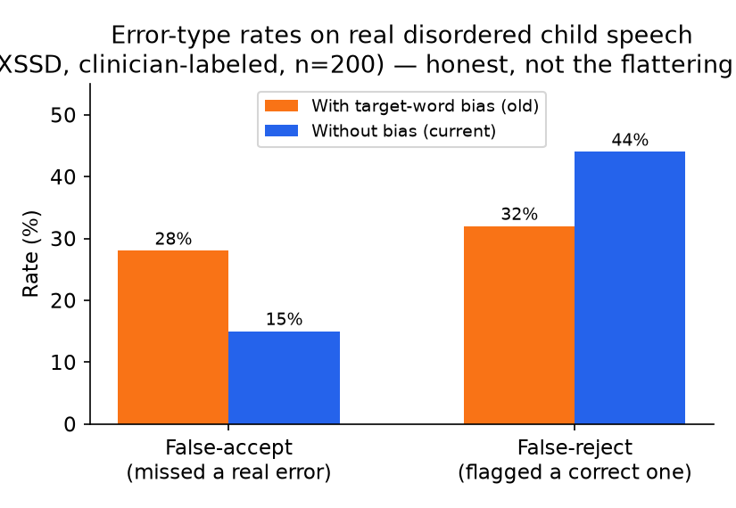

# ArticuPlay

AI-assisted speech-therapy drill app for children with Childhood Apraxia of Speech (CAS).
A child hears a target word (TTS), repeats it, and the app scores the pronunciation at the
phoneme level — substitution, omission, cluster-reduction, syllable-deletion — matching how a
real speech-language pathologist assesses CAS, rather than a simple right/wrong check.

**Status: in active development, not yet publicly deployed.** Backend and frontend are built
and verified end-to-end (register → create child → run a drill session → real speech scored →
retry logic → session complete) with real voice input in a local test environment.

**Language: English only, currently.** The architecture is designed to support more (a
swappable per-language LoRA adapter on a shared multilingual Whisper base, plus a
`phonemizer` language-code swap for IPA scoring) — but no second-language adapter has been
built or trained yet. Don't read "multilingual-ready architecture" as "multilingual today."

## Stack

- **Backend**: FastAPI + SQLAlchemy (async) + Alembic + PostgreSQL (Supabase)
- **Frontend**: React 19 + TypeScript + Vite + Tailwind CSS
- **Speech recognition**: self-hosted Whisper (`faster-whisper`), LoRA fine-tuned (see below)
- **Phoneme scoring**: `phonemizer` (espeak-ng backend) for IPA conversion, custom Wagner-Fischer
  edit-distance alignment for error classification
- **TTS**: `edge-tts` (free, no API key)
- Fully self-hosted — zero per-request inference cost.

## Models trained

This isn't a wrapper around a hosted API — the speech-recognition model is genuinely trained,
with an explicit generalization test (not just re-testing on training vocabulary) at every stage.

### Phoneme classifier (`research/phone_classifier/`)
Binary correct/needs-work classifier for two CAS-relevant phone categories (velars, rhotics),
trained on real disordered child speech (UltraSuite UXSSD corpus, leave-one-speaker-out CV).
- v1 — frozen Whisper encoder embeddings + linear head: **60.9%**
- v2 — LoRA-unfrozen encoder (`r=8, alpha=16`): **67.9%**

### Speech-to-text transcriber (`research/uxtd_transcriber/`)
Whisper-small, progressively fine-tuned on UltraSuite UXTD (child speech corpus) plus synthetic
TTS audio of the app's own product vocabulary:

| Stage | What changed | Result |
|---|---|---|
| Full fine-tune | All 243M params updated | Overfit / catastrophic forgetting |
| LoRA (`r=16, alpha=32`, UXTD only) | Adapter-only fine-tune (1.77M trainable params, 0.73%) | Fixed overfitting, but vocabulary mismatch with product words |
| LoRA + sentence augmentation | Added 100 synthetic sentence examples | Fixed sentence-level (Level 5) collapse |
| LoRA + full product vocabulary (250 words) | Added all 250 original product words as synthetic audio | 94.8% on training vocabulary — but untested on unseen words |
| **LoRA + expanded vocabulary (491 words, current)** | Expanded word bank (wider category variety: animals, food, body parts, verbs, emotions, new phrase/sentence structures), retrained | **96.0% phoneme accuracy on a genuinely held-out 30-word set never seen in training, vs 80.0% for stock Whisper** — verified stable across 3 independent training seeds (96.0% / 98.2% / 96.0%, spread 2.2 points) |

## Honest results (not just the headline number)

Rigor checks run against the current model, including the uncomfortable ones:

- **Generalization**: 96.0% vs base Whisper's 80.0%, on vocabulary that did not exist when the
  model was trained (not a re-test on training data).
- **Reproducibility**: stable across seeds 42/43/44 (96.0% / 98.2% / 96.0%).
- **Latency**: ~2s CPU inference, ~3.0-3.5s end-to-end through the real API (webm decode + request
  overhead) — at the edge of the 3s/item budget, no headroom.
- **Real disordered-speech error detection** (the model's actual clinical job, tested on the
  UltraSuite UXSSD corpus of real children with CAS, clinician-labeled): **false-accept 28% /
  false-reject 32%** with target-word decoding bias; **15% / 44%** without it. This is the
  honest weak point — word-recognition generalizes well, but reliably catching a genuinely wrong
  pronunciation (vs. one that still sounds like the right word) is still an open problem. The
  planned fix is routing scoring through the phoneme classifier above instead of ASR-transcript
  text, which is not yet integrated.

## Known open items

- Phoneme-classifier-based error scoring (real fix for the false-accept/reject numbers above)
- Real webm/opus browser audio confirmed working end-to-end, but not yet stress-tested at scale
- Multi-language support — architecture supports it (swappable per-language LoRA adapter + a
  `phonemizer` language-code swap), not yet built for a second language

## License note on training data

Fine-tuning used the UltraSuite corpus (UXTD, UXSSD, Cleft — CC BY-NC 4.0, non-commercial). The
corpus itself is not redistributed in this repo; only the training/evaluation scripts are.
