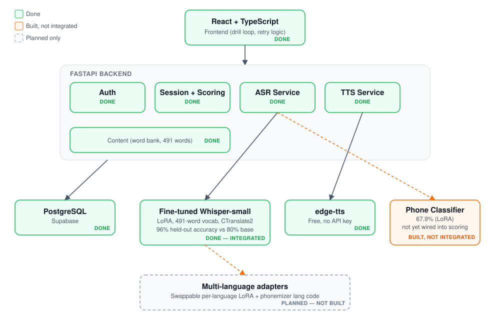

# ArticuPlay

AI-assisted speech-therapy drill app for children with Childhood Apraxia of Speech (CAS).
A child hears a target word (TTS), repeats it, and the app scores the pronunciation at the
phoneme level — substitution, omission, cluster-reduction, syllable-deletion — matching how a
real speech-language pathologist assesses CAS, rather than a simple right/wrong check.

**Status: in active development, not yet publicly deployed.** Backend and frontend are built
and verified end-to-end (register → create child → run a drill session → real speech scored →
retry logic → session complete) with real voice input in a local test environment.

**Language: English only, currently.** The architecture is designed to support more (a
swappable per-language LoRA adapter on a shared multilingual Whisper base, plus a
`phonemizer` language-code swap for IPA scoring) — but no second-language adapter has been
built or trained yet. Don't read "multilingual-ready architecture" as "multilingual today."

## Architecture

Green/solid = shipped and integrated. Dashed gray = designed for, not built (multi-language
adapters).

## Stack

- **Backend**: FastAPI + SQLAlchemy (async) + Alembic + PostgreSQL (Supabase)
- **Frontend**: React 19 + TypeScript + Vite + Tailwind CSS
- **Speech recognition**: self-hosted Whisper (`faster-whisper`), LoRA fine-tuned (see below)
- **Phoneme scoring**: `phonemizer` (espeak-ng backend) for IPA conversion, custom Wagner-Fischer
  edit-distance alignment for error classification
- **TTS**: `edge-tts` (free, no API key)
- Fully self-hosted — zero per-request inference cost.

## Models trained

This isn't a wrapper around a hosted API — the speech-recognition model is genuinely trained,
with an explicit generalization test (not just re-testing on training vocabulary) at every stage.

### Phoneme classifier (`research/phone_classifier/`)
Binary correct/needs-work classifier for two CAS-relevant phone categories (velars, rhotics),
trained on real disordered child speech (UltraSuite UXSSD corpus, leave-one-speaker-out CV).
- v1 — frozen Whisper encoder embeddings + linear head: **60.9%**
- v2 — LoRA-unfrozen encoder (`r=8, alpha=16`): **67.9%**

### Speech-to-text transcriber (`research/uxtd_transcriber/`)
Whisper-small, progressively fine-tuned on UltraSuite UXTD (child speech corpus) plus synthetic
TTS audio of the app's own product vocabulary:

| Stage | What changed | Result |
|---|---|---|
| Full fine-tune | All 243M params updated | Overfit / catastrophic forgetting |
| LoRA (`r=16, alpha=32`, UXTD only) | Adapter-only fine-tune (1.77M trainable params, 0.73%) | Fixed overfitting, but vocabulary mismatch with product words |
| LoRA + sentence augmentation | Added 100 synthetic sentence examples | Fixed sentence-level (Level 5) collapse |
| LoRA + full product vocabulary (250 words) | Added all 250 original product words as synthetic audio | 94.8% on training vocabulary — but untested on unseen words |
| **LoRA + expanded vocabulary (491 words, current)** | Expanded word bank (wider category variety: animals, food, body parts, verbs, emotions, new phrase/sentence structures), retrained | **96.0% phoneme accuracy on a genuinely held-out 30-word set never seen in training, vs 80.0% for stock Whisper** — verified stable across 3 independent training seeds (96.0% / 98.2% / 96.0%, spread 2.2 points) |

### Model version history

Every distinct model/code version this project has produced, in order — #1 is the first,
the highest number is what's live today. Current versions link to their real file in this repo;
retired versions that got edited in place (before this repo's history began) link into
[`archive/`](archive/) so nothing is lost.

| # | Version | Result | Code |
|---|---|---|---|
| 1 | Phone classifier v1 — frozen encoder | 60.9% | [`train_classifier.py`](research/phone_classifier/train_classifier.py) |
| 2 | Phone classifier v2 — LoRA-unfrozen encoder | 67.9% | [`train_classifier_unfrozen.py`](research/phone_classifier/train_classifier_unfrozen.py) |
| 3 | Transcriber — full fine-tune | Overfit / catastrophic forgetting | [`train.py`](research/uxtd_transcriber/train.py) |
| 4 | Transcriber — LoRA, UXTD data only | Fixed overfitting, vocab mismatch remained | [`train_lora.py`](research/uxtd_transcriber/train_lora.py) |
| 5 | Transcriber — LoRA + sentence augmentation | Fixed Level 5 (sentence) collapse | [`train_lora_augmented.py`](research/uxtd_transcriber/train_lora_augmented.py) |
| 6 | Transcriber — LoRA + 250-word vocab | 94.8% in-sample | [`archive/train_lora_fullvocab_250vocab.py`](archive/train_lora_fullvocab_250vocab.py) |
| 7 | Held-out eval of #6 vs base, n=50 | 82.7% → 95.2% *(superseded)* | [`archive/evaluate_new_words_heldout_50word_v2.py`](archive/evaluate_new_words_heldout_50word_v2.py) |
| 8 | Production ASRService v1 — base Whisper + target-word bias | false-accept 28% / false-reject 32% | [`archive/asr_service_v1_base_biased.py`](archive/asr_service_v1_base_biased.py) |
| 9 | Transcriber — LoRA + 491-word vocab | **80.0% → 96.0%, n=30, current** — stable across seeds (96.0/98.2/96.0) | [`train_lora_fullvocab.py`](research/uxtd_transcriber/train_lora_fullvocab.py) + [`evaluate_new_words_heldout.py`](research/uxtd_transcriber/evaluate_new_words_heldout.py) |
| 10 | Production ASRService v2 — #9's model, bias removed | false-accept 15% / false-reject 44% | "before" side of [commit 2c1ab46](https://github.com/roshnrf/ArticuPlay/commit/2c1ab460aa4ba69266f6f41ec10e16207229dc4c) |
| 11 | Phone classifier — final deployable checkpoint (trained on all 864 real examples, no CV holdout) | Ready to integrate | [`train_classifier_final.py`](research/phone_classifier/train_classifier_final.py) |
| 12 | Production ASRService v3 — #10 + phone classifier gate | **false-accept 3% / false-reject 46%, current** | [`asr_service.py`](backend/app/services/asr_service.py) + [`phone_classifier_service.py`](backend/app/services/phone_classifier_service.py) |

**Going forward**: any time a script gets edited in place to produce a new result rather than
saved as a new file, the pre-edit version goes in `archive/` before the edit — so the code
behind every number stays inspectable, not just the latest one.

## Honest results (not just the headline number)

Rigor checks run against the current model, including the uncomfortable ones:

- **Generalization**: 96.0% vs base Whisper's 80.0%, on vocabulary that did not exist when the
  model was trained (not a re-test on training data).
- **Reproducibility**: stable across seeds 42/43/44 (96.0% / 98.2% / 96.0%).
- **Latency**: ~2s CPU inference, ~3.0-3.5s end-to-end through the real API (webm decode + request
  overhead) — at the edge of the 3s/item budget, no headroom.
- **Real disordered-speech error detection** (the model's actual clinical job, tested on the
  UltraSuite UXSSD corpus of real children with CAS, clinician-labeled), measured through the
  live deployed pipeline, not just the raw model:

  | Stage | False-accept | False-reject |
  |---|---|---|
  | Target-word decoding bias (original) | 28% | 32% |
  | Unbiased decoding | 15% | 44% |
  | **+ Phoneme classifier gate (current)** | **3%** | 46% |

  Transcript-based scoring alone can't catch a real articulation error when the transcript
  still reads as the right word. Routing through the phoneme classifier as a one-directional
  gate (only ever downgrades a pass, never upgrades a fail) closed most of that gap — false-accept
  dropped from 28% to 3%. False-reject is flat (a few real-correct attempts get wrongly downgraded
  by the classifier's own ~68% accuracy — the accepted cost of closing the more dangerous
  direction first).

## Known open items

- Remaining 3% false-accept and the flat 46% false-reject on real disordered speech — the
  phoneme classifier itself is only ~68% accurate, a ceiling on how far this approach alone gets
- Real webm/opus browser audio confirmed working end-to-end, but not yet stress-tested at scale
- CPU latency (~3s, no headroom) — needs webm-decode optimization or GPU hosting for a real pilot
- Multi-language support — architecture supports it (swappable per-language LoRA adapter + a
  `phonemizer` language-code swap), not yet built for a second language

## License note on training data

Fine-tuning used the UltraSuite corpus (UXTD, UXSSD, Cleft — CC BY-NC 4.0, non-commercial). The
corpus itself is not redistributed in this repo; only the training/evaluation scripts are.
